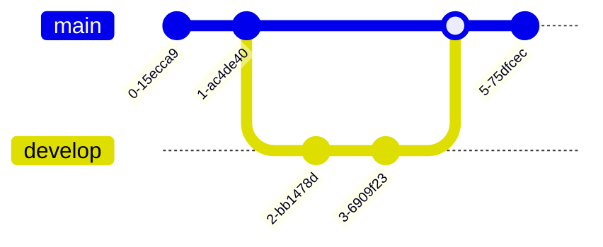

# Mermaid Diagram Examples

This document contains examples of all diagram types supported by mermaid-check.

## Table of Contents

1. [Flowchart](#flowchart)
2. [Sequence Diagram](#sequence-diagram)
3. [Class Diagram](#class-diagram)
4. [State Diagram](#state-diagram)
5. [Entity Relationship Diagram](#entity-relationship-diagram)
6. [Gantt Chart](#gantt-chart)
7. [Pie Chart](#pie-chart)
8. [User Journey](#user-journey)
9. [Git Graph](#git-graph)
10. [Mindmap](#mindmap)
11. [Timeline](#timeline)
12. [Quadrant Chart](#quadrant-chart)
13. [Sankey Diagram](#sankey-diagram)
14. [XY Chart](#xy-chart)
15. [C4 Diagrams](#c4-diagrams)
    - [C4 Context](#c4-context)
    - [C4 Container](#c4-container)
    - [C4 Component](#c4-component)
    - [C4 Dynamic](#c4-dynamic)
    - [C4 Deployment](#c4-deployment)

---

## Flowchart

Flowcharts visualise processes, decisions, and workflows.

**Supported directions**: `TB` (top-bottom), `TD` (top-down), `BT` (bottom-top), `RL` (right-left), `LR` (left-right)

**Alternative syntax**: `graph` can be used instead of `flowchart`

---

## Sequence Diagram

Sequence diagrams show interactions between participants over time.

**Key features**:
- Participants and actors
- Messages (solid arrows `->`, dotted arrows `-->`)
- Loops, alternatives, and parallel sections
- Notes and activation boxes

---

## Class Diagram

Class diagrams model object-oriented systems with classes, attributes, methods, and relationships.

**Relationships**: `<|--` (inheritance), `*--` (composition), `o--` (aggregation), `-->` (association), `..>` (dependency)

---

## State Diagram

State diagrams model system states and transitions.

**Key features**:
- Initial state `[*]`
- State transitions with triggers
- Composite states
- Concurrent states with `--`

---

## Entity Relationship Diagram

ER diagrams model database schemas and relationships between entities.

**Cardinality notation**:
- `||` exactly one
- `o{` zero or more
- `|{` one or more
- `}|` one or more (right side)

---

## Gantt Chart

Gantt charts display project schedules and task dependencies.

**Key features**:
- Date formats and ranges
- Task dependencies
- Sections for grouping
- Active, done, and critical task states

---

## Pie Chart

Pie charts show proportional data distribution.

**Features**:
- Optional title
- Label and value pairs
- Automatic percentage calculation

---

## User Journey

User journey diagrams map user experiences and satisfaction levels.

**Features**:
- Satisfaction scores (1-5)
- Multiple actors
- Sectioned activities

---

## Git Graph

Git graph diagrams visualise Git branching and merging workflows.

**Key commands**:
- `commit` - create commit
- `branch` - create branch
- `checkout` - switch branch
- `merge` - merge branches
- `cherry-pick` - cherry-pick commit

---

## Mindmap

Mindmaps organise ideas hierarchically.

**Features**:
- Hierarchical structure through indentation
- Root node with branches
- Multiple levels of nesting
- Line breaks with ` `

---

## Timeline

Timeline diagrams display chronological events.

**Features**:
- Chronological ordering
- Multiple events per time period
- Optional title

---

## Quadrant Chart

Quadrant charts plot items in a 2D space with labelled quadrants.

**Features**:
- Custom axis labels
- Four quadrant labels
- Coordinate-based data points (0-1 range)

---

## Sankey Diagram

Sankey diagrams visualise flows and quantities between nodes.

**Features**:
- Source and target nodes
- Flow quantities
- Multi-level flow chains
- Currently in beta (`sankey-beta`)

---

## XY Chart

XY charts display data series on X-Y axes.

**Features**:
- Bar and line series
- Custom axis ranges
- Multiple data series
- Currently in beta (`xychart-beta`)

---

## C4 Diagrams

C4 diagrams model software architecture at different levels of abstraction.

### C4 Context

System context diagrams show how your system fits in the world.

### C4 Container

Container diagrams show the high-level technology choices.

### C4 Component

Component diagrams show how a container is made up of components.

### C4 Dynamic

Dynamic diagrams show how components collaborate for a specific scenario.

### C4 Deployment

Deployment diagrams show how containers are deployed to infrastructure.

---

## Notes

- All examples use British English spelling in comments and labels where applicable
- Line breaks in labels use ` ` not `\n`
- Comments in Mermaid use `%%` prefix
- Round brackets `()` should be avoided in labels; use brackets `[]` or braces `{}` for node shapes instead
